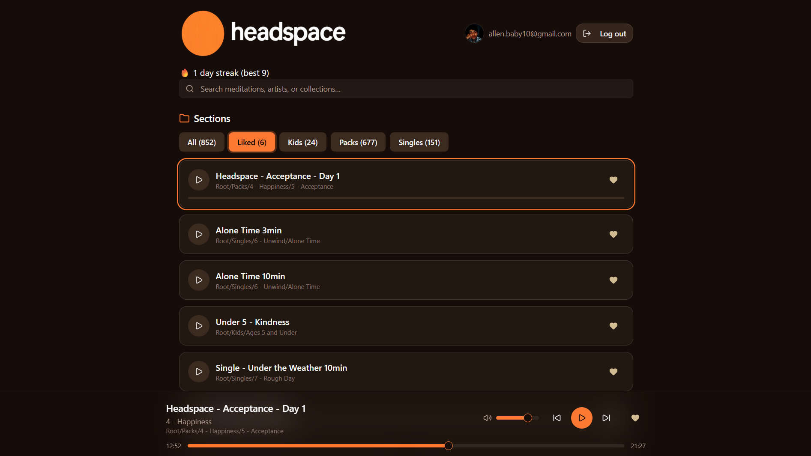

# 🧘 Meditation App

A full-stack meditation and mindfulness web app built with **Next.js 15**, **React 19**, and **Supabase**.  
It provides a library of meditation tracks, user authentication, streak tracking, and likes to encourage consistent practice.



---

## 📂 Project Structure
```
public/
  banner.png           # App banner image

src/
  app/
    page.js            # Main landing page
    layout.js          # Root layout with providers
    globals.css        # Global Tailwind styles
    api/               # API routes
      drive/[id]/route.js     # Fetch track by ID
      drive-list/route.js     # List available meditation tracks
      like-counts/route.js    # Manage likes
      streak/route.js         # Track user streaks
    auth/callback/route.js    # Authentication callback
    _providers/        # Context providers
      QueryProvider.jsx
      SessionProvider.jsx
  components/          # Reusable UI components
    AudioPlayer.jsx
    MeditationLibrary.jsx
    StreakBadge.jsx
    TrackCard.jsx
    HeaderAuth.jsx
    ui/                # Radix/Tailwind UI wrappers
      button.jsx
      card.jsx
      input.jsx
      slider.jsx
  features/
    likes/LikesProvider.jsx   # Context provider for likes
  lib/
    supabaseBrowser.js
    supabaseServer.js
    utils.js
```

---

## 🚀 Getting Started

### Prerequisites
- [Node.js](https://nodejs.org/) 18+
- [Supabase](https://supabase.com/) project (with API keys)
- A `.env.local` file with the following variables:

```env
NEXT_PUBLIC_SUPABASE_URL=your-project-url
NEXT_PUBLIC_SUPABASE_ANON_KEY=your-anon-key
SUPABASE_SERVICE_ROLE_KEY=your-service-role-key
```

### Installation
```bash
git clone https://github.com/your-username/meditation-app.git
cd meditation-app
npm install
```

### Running Locally
```bash
npm run dev
```

Then open your browser at [http://localhost:3000](http://localhost:3000).

---

## 🛠️ Tech Stack
- **Next.js 15** – App Router & Server Components
- **React 19**
- **Supabase** – Auth, database, and storage
- **TanStack React Query** – Data fetching and caching
- **Radix UI** + **Tailwind CSS** – Accessible UI components
- **Lucide React** – Icons
- **Luxon** – Date/time handling

---

## 🎯 Features

### 🔑 Authentication
- Supabase-powered login/signup.
- Callback route (`/auth/callback`) handles session creation.

### 🎵 Meditation Library
- Displays available tracks from Supabase storage (`drive-list`).
- Users can play audio using the `AudioPlayer` component.
- `TrackCard` shows metadata (title, duration, likes).

### ❤️ Likes
- Users can like meditation tracks.
- Handled `LikesProvider` context.
- `MeditationLibrary` displays like count in real time.

### 🔥 Streak Tracking
- Keeps track of daily meditation streaks.
- `StreakBadge` visualizes user progress.
- Data managed by the `/api/streak` route.

### 🧑‍💻 Providers
- **SessionProvider** – Supplies Supabase authentication session.
- **QueryProvider** – Wraps TanStack Query for caching and async state.

### 📱 Responsive Design
- Built with **Tailwind CSS**.
- Radix UI for accessibility.
- Optimized for both desktop and mobile.

---

## 📦 Deployment
This project is optimized for deployment on **Vercel**:

```bash
vercel
```

Make sure to add your environment variables in Vercel’s dashboard.

---

## 📝 Usage Guide

1. **Sign Up / Log In**  
   - Use the Supabase auth flow to create an account.  
   - Session is persisted via `SessionProvider`.

2. **Browse Meditations**  
   - Navigate to the Meditation Library.  
   - Tracks are loaded dynamically from a google drive link (https://drive.google.com/drive/folders/1_Wy5TIxZGPt42t5G3jhF7nMWdvQ3GsUf).

3. **Play a Track**  
   - Use the `AudioPlayer` to listen.  
   - Supports pause/resume.

4. **Like a Track**  
   - Click the like button on any track card.  
   - Updates count instantly via `like-counts` API.

5. **Maintain Streaks**  
   - Meditating and completing any track once per day updates your streak count.  
   - Check your `StreakBadge` for motivation!

---

## 🤝 Contributing
Pull requests are welcome.  
For major changes, open an issue first to discuss improvements.

---

## 📄 License
[MIT](LICENSE)

---
✨ Happy Meditating! ✨
